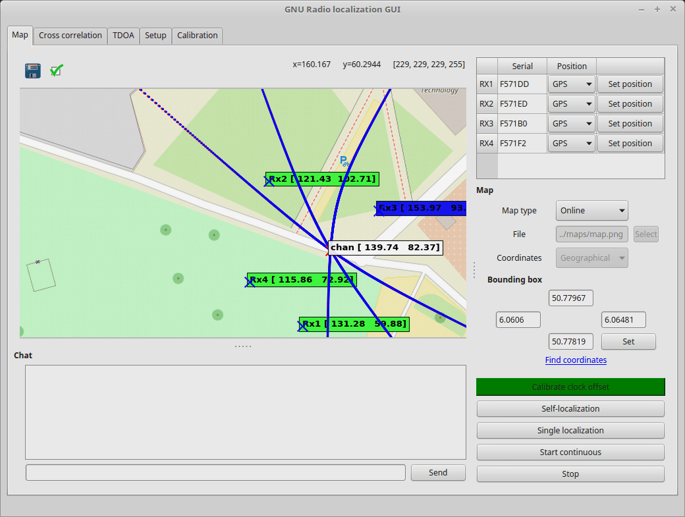

gr-localization GNU Radio based localization framework
======================================================
Application to perform localization experiments using SDR. Includes software for the receivers, fusion center and GUI.

Dependencies
------------------
In order to execute the gr-localization you will need to install the following prerequisites
- GNU Radio (http://gnuradio.org/)
- UHD Driver for USRP hardware
- ZeroMQ including the C++ and Python bindings (http://zeromq.org/)
- python-qwt5-qt4
- python-scipy
- python-pyproj
- python-matplotlib
- python-mpltoolkits.basemap

command: sudo apt-get install python-qwt5-qt4 python-scipy python-pyproj python-matplotlib python-mpltoolkits.basemap

Recommended:
--------------
Install ntp server:
- ntp

Add these lines to /etc/ntp.conf

    server 127.127.1.0
    fudge 127.127.1.0 stratum 10
    broadcast 192.168.10.255 #system network

Add the following lines to /etc/sudoers in order to allow the user to change the system time:

    "username" ALL=(ALL) NOPASSWD: /bin/date
    "username" ALL=(ALL) NOPASSWD: /usr/sbin/ntpdate

How to run the app
-------------------

First make sure all the computers are reachable and firewalls are not blocking the connection.

To run a basic scenario with one fusion center, one GUI and several receivers and integrated LCXO disciplined oscilators run the following from the apps folder:

Option 1:

Computer 1 (Fusion center, GUI and receiver):

    ./fusion_center.py
    ./gui.py
    ./receiver.py --ntp-server

Computers 2 and 3 (receiver):

    ./receiver.py --fusion-center "fusion_center_ip_addr"

To reach a longer battery runtime and faster processing, outrsourcing the fusion center to a faster Desktop computer is recommended:

Computer 1 (Fusion center):

    ./fusion_center.py

Computers 2 to 4(receivers):

    ./receiver.py --fusion-center "fusion_center_ip_addr"
    
    and at one or more of them:
    
    ./gui.py --fusion-center "fusion_center_ip_addr"

Several receivers or GUIs can be run in the system specifying the fusion center ip address.
If more than one receiver or GUI is going to be executed in the same computer, specify an index with -i option:

    ./receiver.py -i 1 --fusion-center "fusion_center_ip_addr"
    ./receiver.py -i 2 --fusion-center "fusion_center_ip_addr"
    ./gui.py -i 1 --fusion-center "fusion_center_ip_addr"
    ./gui.py -i 2 --fusion-center "fusion_center_ip_addr"

In order to have more accurate results, NTP usage is recommended. Run one of the receivers with --ntp-server option:

    ./receiver_flowgraph.py --fusion-center "fusion_center_ip_addr" --ntp-server

If the clock reference is not the internal oscillator use -g option with one of the compatible devices:

    ./receiver.py -g lte_lite
    ./receiverpy -g octoclock

Once everything is running the different components should appear in the setup tab of the GUI.

Copyright information
------------------
Copyright © 2017 Institute for Theoretical Information Technology,
                 RWTH Aachen University <https://www.ti.rwth-aachen.de/>

